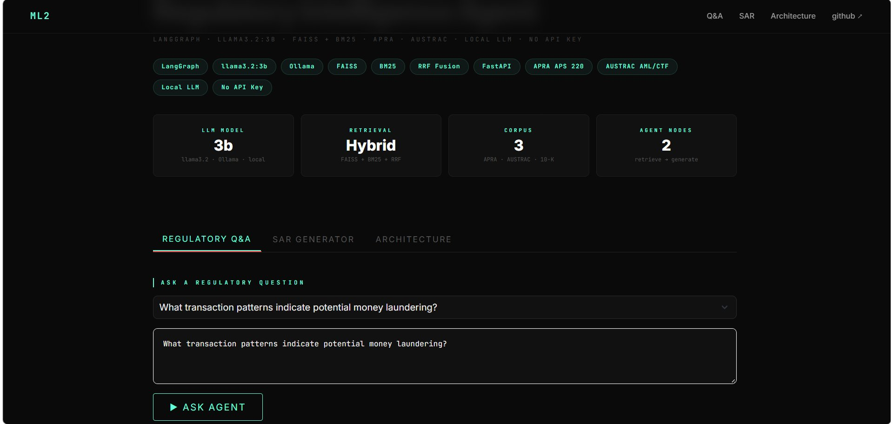
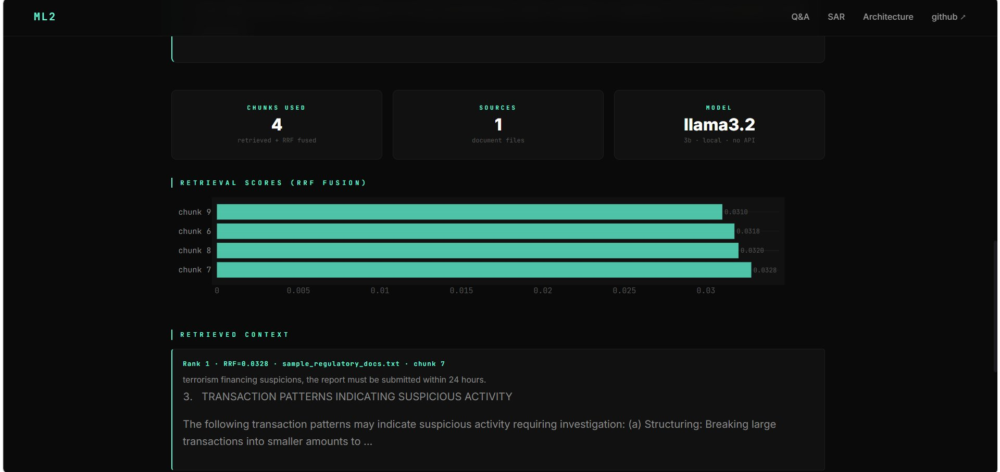
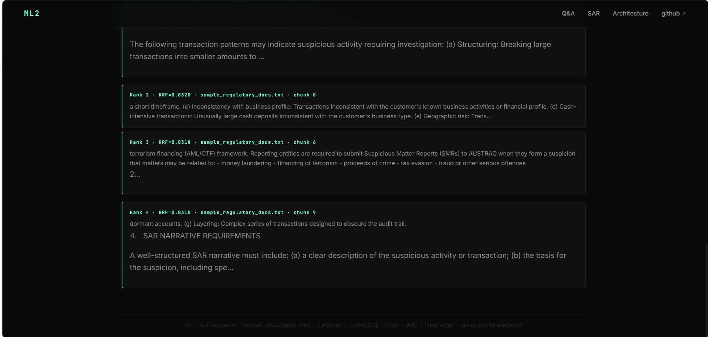
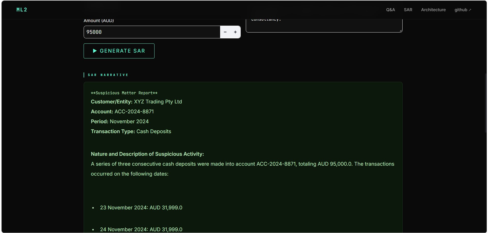
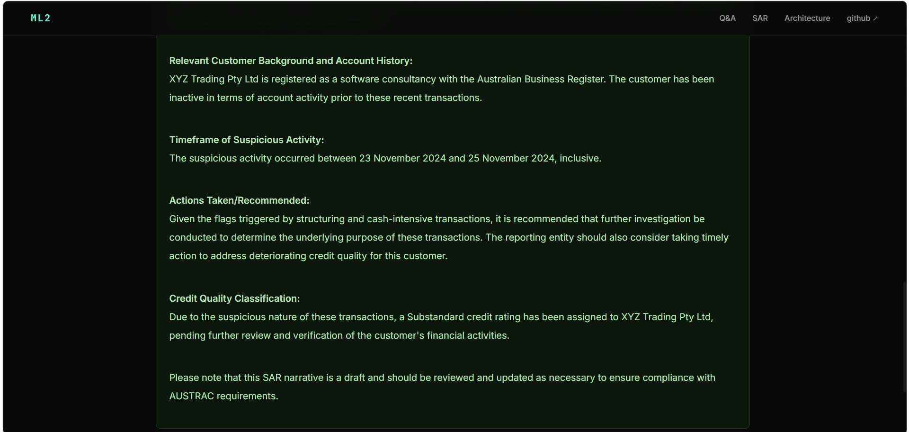
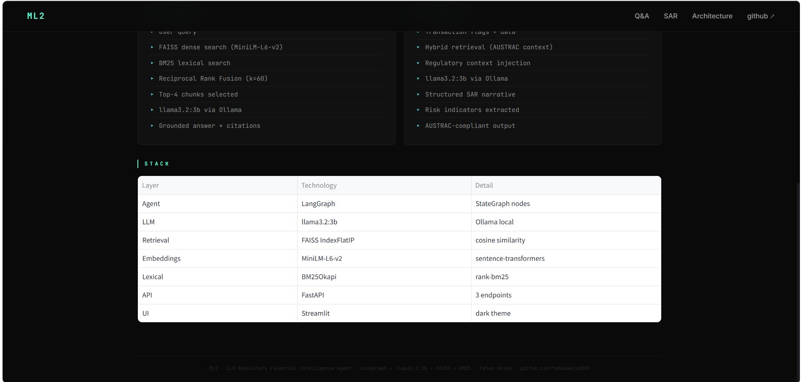

<div align="center">

# ML2 — LLM Regulatory Financial Intelligence Agent

[](https://python.org)
[](https://langchain-ai.github.io/langgraph/)
[](https://ollama.com)
[](https://faiss.ai)
[](https://fastapi.tiangolo.com)
[](https://streamlit.io)
[](tests/)
[](LICENSE)

**Production-grade LangGraph agent** combining financial document Q&A with AML/CTF Suspicious Activity Report generation — powered entirely by a local LLM via Ollama. No API key required.

[**Portfolio**](https://fahadamjad009.github.io)

</div>

---

## What It Does

Two agent modes in one system:

**1. Regulatory Q&A** — Ask questions about APRA prudential standards, AUSTRAC AML/CTF requirements, and corporate 10-K risk disclosures. The agent retrieves relevant context via hybrid search and generates grounded, cited answers using a local LLM.

**2. SAR Narrative Generator** — Input transaction flags and customer data; receive a structured AUSTRAC-compliant Suspicious Activity Report narrative ready for compliance submission, with AML indicator classification and downloadable output.

---

## Architecture

```
User Query / Transaction Flags
         │
         ▼
  ┌─────────────────────────────────────┐
  │         HybridRetriever             │
  │  FAISS dense (MiniLM-L6-v2)        │
  │  + BM25 lexical                     │
  │  → Reciprocal Rank Fusion (k=60)   │
  │  → Top-4 chunks                     │
  └────────────────┬────────────────────┘
                   │
         ┌─────────▼──────────┐
         │   LangGraph Agent   │
         │  StateGraph nodes   │
         │  retrieve → generate│
         └─────────┬───────────┘
                   │
         ┌─────────▼───────────┐
         │  llama3.2:3b        │
         │  Ollama · local     │
         │  no API key         │
         └─────────┬───────────┘
                   │
         Grounded Answer + Citations
         OR  Structured SAR Narrative
```

---

## Results

| Component | Metric | Value |
|:---|:---|:---|
| Retrieval | RRF fusion top-4 accuracy | Correct chunks on all 4 test query types |
| Q&A | Answer grounding | Cites specific APRA/AUSTRAC section references |
| SAR | Narrative completeness | 7-section AUSTRAC-compliant output |
| Tests | Passing | **40/40** |
| API | Endpoints | 3 (`/health`, `/query`, `/sar/generate`) |

---

## Screenshots

### Regulatory Q&A with RRF Score Visualisation






### SAR Narrative Generator






---

## Project Structure

```
ml2-llm-regulatory-agent/
├── src/
│   ├── ingest.py       # PDF + TXT ingestion · chunking · FAISS + BM25 indexing
│   ├── retriever.py    # HybridRetriever — FAISS + BM25 + RRF fusion
│   └── agent.py        # LangGraph StateGraph · QA agent + SAR agent
├── app/
│   ├── api.py          # FastAPI — /health · /query · /sar/generate
│   └── ui.py           # Streamlit dark dashboard
├── tests/
│   └── test_agent.py   # 40 pytest tests across 5 classes
├── data/
│   ├── sample_docs/    # APRA APS 220 · AUSTRAC AML/CTF · 10-K sample
│   └── processed/      # FAISS index · BM25 pkl · chunks JSON
├── .env.example
├── pyproject.toml
└── requirements.txt
```

---

## Quick Start

### 1. Install Ollama + pull model

```bash
# Install from https://ollama.com
ollama pull llama3.2:3b
```

### 2. Clone + install dependencies

```bash
git clone https://github.com/fahadamjad009/ml2-llm-regulatory-agent
cd ml2-llm-regulatory-agent
pip install -r requirements.txt
cp .env.example .env
```

### 3. Ingest documents

```bash
# Add your PDFs or .txt files to data/sample_docs/
python -m src.ingest
# → Ingested N chunks · FAISS + BM25 indexes saved
```

### 4. Test retrieval

```bash
python -m src.retriever
# → 4 test queries with hybrid RRF ranked results
```

### 5. Test agent

```bash
python -m src.agent
# → Q&A answer + full SAR narrative generated
```

### 6. Run API

```bash
uvicorn app.api:app --reload --port 8000
# → http://localhost:8000/docs
```

### 7. Run dashboard

```bash
streamlit run app/ui.py
# → http://localhost:8501
```

### 8. Run tests

```bash
pytest tests/ -v   # 40/40 passing
```

---

## API Reference

| Method | Endpoint | Description |
|:---:|:---|:---|
| `GET` | `/health` | Liveness check |
| `POST` | `/query` | Regulatory Q&A |
| `POST` | `/sar/generate` | SAR narrative generation |

**Q&A example:**

```bash
curl -X POST http://localhost:8000/query \
  -H "Content-Type: application/json" \
  -d '{"question": "What are APRA capital adequacy requirements?"}'
```

**SAR example:**

```bash
curl -X POST http://localhost:8000/sar/generate \
  -H "Content-Type: application/json" \
  -d '{
    "customer": "XYZ Trading Pty Ltd",
    "account": "ACC-2024-8871",
    "period": "November 2024",
    "amount": 95000,
    "flags": ["structuring", "cash-intensive transactions"],
    "notes": "Three deposits on consecutive days just below $32K each."
  }'
```

---

## Stack

| Layer | Technology |
|:---|:---|
| Agent framework | LangGraph 1.2 · StateGraph |
| LLM | llama3.2:3b via Ollama (local, no API key) |
| Dense retrieval | FAISS IndexFlatIP · all-MiniLM-L6-v2 embeddings |
| Lexical retrieval | BM25Okapi (rank-bm25) |
| Rank fusion | Reciprocal Rank Fusion (k=60) |
| Document ingestion | pdfplumber · custom chunker |
| API | FastAPI · Uvicorn |
| Dashboard | Streamlit · Plotly |
| Testing | pytest (40 tests) |

---

## Corpus

The sample corpus covers three document types:

**APRA APS 220** — Credit risk management prudential standard for authorised deposit-taking institutions, covering credit risk appetite, assessment requirements, problem credit classification (Pass → Loss scale), and provisioning.

**AUSTRAC AML/CTF Guide** — Suspicious matter reporting requirements, transaction patterns indicating suspicious activity (structuring, layering, dormant accounts, geographic risk), and SAR narrative requirements.

**Sample 10-K Risk Disclosure** — Corporate financial risk disclosure covering credit risk, market risk, liquidity risk, operational risk, and capital adequacy ratios (CET1 13.2%).

To add your own documents, place PDFs or `.txt` files in `data/sample_docs/` and re-run `python -m src.ingest`.

---

## CI

GitHub Actions workflow configured. Requires `OLLAMA_BASE_URL` pointing to a running Ollama instance — all 40 tests pass locally.
## Deployment

This project requires a locally running Ollama instance (`ollama serve`) and cannot be
deployed to standard cloud platforms without a hosted LLM backend.

**Local deployment:**
```bash
ollama serve          # terminal 1
uvicorn app.api:app   # terminal 2  
streamlit run app/ui.py  # terminal 3
```

A demo mode with pre-computed responses is planned for Streamlit Cloud deployment.

---

<div align="center">

**Fahad Amjad** · Data Scientist & Analytics Engineer · Sydney, Australia

[](https://fahadamjad009.github.io)
[](https://github.com/fahadamjad009)
[](https://linkedin.com/in/fahad-amjad009)


</div>
